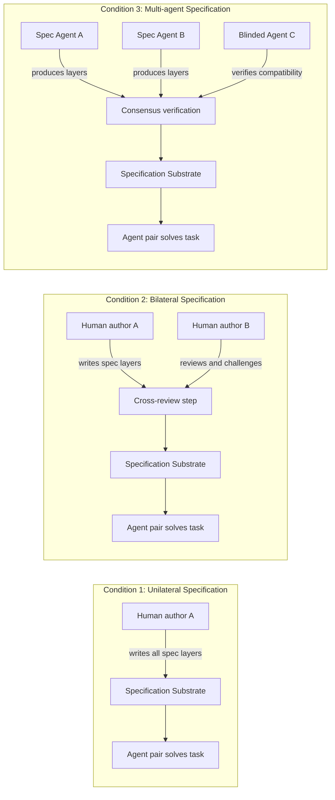

# Correctness Without Ground Truth

> **Status:** working draft — forwarded from Sophia's publication-strategy email
> (May 11, 2026). Contains the full paper draft plus Sophia's suggestions for
> expanding the Discussion section's Self-Organization phase. The relationship
> to `orchestration paper.md` / `foundations.md` is noted at the end but the two projects
> remain separate for now.

---

## Core Thesis

All correctness is constraint satisfaction over layered clarifications.
Correctness is not correspondence to ground truth. It is consensus that survives observation.

---

## The Problem

Current LLM benchmarks measure a model's output against human-authored ground truth at a single, fixed specification level -- the raw prompt. When a model fails, we attribute this to a capability gap. But failure has two possible causes:

1. Capability gap -- the model genuinely cannot perform the task.
2. Protocol gap -- the model could perform the task but misinterpreted the specification.

Current evaluation conflates these. Every benchmark score is a joint measurement of capability and communication loss between the evaluator's intent and the model's interpretation. We attribute all failure to capability and measure the wrong thing.

## The Deeper Claim

Correctness is not a property of an output measured against a static answer key. Correctness is consensus -- a state achieved through layered clarification between communicating agents. There is no specification level that serves as source-of-truth. Instead, through progressive narrowing of the interpretation space, agents converge on shared understanding. Consensus emerges not because someone defined the answer, but because shared constraints eliminated alternatives.

This reframes evaluation failures as inter-agent communication loss. A human writes an eval. An LLM interprets it. The gap between intent and interpretation is not a capability deficit -- it is a failed handshake in a protocol with insufficient verification layers.

## The Analogy: TCP for Correctness

Current LLM systems communicate correctness like UDP -- fire and pray. A prompt is sent, a response is returned, and we hope it's correct. No handshake. No checksum. No shared state about what's been established. What's needed is TCP for correctness:

- Handshake: initial agreement on intent
- Checksums: intermediate verification at each layer
- Shared state: accumulated clarifications that don't need renegotiation
- Retransmission: when a check fails, retry at that specific layer

The overhead of the protocol is justified because it makes the channel reliable. Intelligence compounds not when agents get smarter, but when the medium between them gets denser. Protocol beats parameters.

---

## Experimental Design

### Core Insight

We do not need ground truth labels. We need multi-agent consensus under intersubjective verification.

### Setup

Agent A and Agent B receive the same task at varying specification levels. They produce outputs independently.

Agent C (the observer) never sees the specification levels. It only judges whether A and B's outputs are equivalent.

### Predictions

At low specification, strong models may produce different but equally valid outputs -- no consensus, because the specification space permits multiple interpretations. As specification increases, the valid interpretation space narrows and models converge.

Strong models reach consensus at shallower specification levels than weak models. This is because their "failures" at raw prompt level were mostly protocol failures, not capability failures. Minimal clarification unlocks what was already there.

Consensus that survives third-party verification is robust. If A and B converge and C independently confirms, the consensus is intersubjectively valid -- not an artifact of shared model biases.

### Metrics

- **Consensus convergence level** -- at what specification depth do agents reach observer-verified agreement? Lower = more capable communicator.
- **Consensus stability** -- does agreement at level K survive third-party observation? Higher = more robust correctness.

### Why This Kills the Circularity

Previous framings had a bootstrapping problem: you need to know what "correct" means to evaluate clarification quality, but correctness is defined by clarification. This design sidesteps it entirely: no ground truth labels are needed, the clarification layers don't need to be "correct" -- they just need to be consistent, correctness emerges from convergence not from an answer key, and the third-party observer provides intersubjective verification without prior knowledge.

### Robustness Check

Define two independent clarification protocols. Run the same models through both. If the consensus convergence rankings are preserved across protocols, the metric is measuring something real about the models, not something baked into the layer definitions.

---

## Benchmark Strategy: SWE-bench as Test Bed

SWE-bench Pro explicitly includes specification levels in their design -- they add requirements and interface specification to resolve ambiguity, evaluating models "in the setting without any ambiguity." SWE-bench Verified has a known problem: some tasks contain genuinely ambiguous issue descriptions, meaning SWE-bench systematically underestimates capability in some cases.

They tried to fix it by curating ambiguity OUT of the benchmark. We propose to keep the ambiguity IN and measure how models handle it at different specification levels. Opposite approach, same underlying insight.

The framing: "SWE-bench removes ambiguity. We measure it."

### Why SWE-bench

- Reviewers already know SWE-bench. No new benchmark to justify.
- Test suites already exist. Objective equivalence is free.
- The failures are documented. We're explaining why they fail.
- SWE-bench Pro acknowledged that ambiguous or underspecified issues are removed from benchmarks, which doesn't reflect real developer workflow. We directly address this.

### CodeScout Connection

CodeScout (Suri et al., 2026) converts underspecified requests into enriched problem statements, achieving +20% on SWE-bench Verified. Their key finding: agents cannot effectively self-augment during execution -- when prompted to do their own specification enrichment, performance drops significantly below baseline. This directly validates our thesis: the specification problem cannot be solved by the agent alone. It needs an external protocol.

CodeScout does one fixed level of augmentation. They don't vary the specification level, don't measure how much was actually needed, and don't ask whether different models need different amounts. Our paper asks the question CodeScout didn't: how much of SWE-bench "failure" is specification failure, and does the answer differ by model?

CodeScout's augmented problem statements can serve as one of our specification levels (approximately Level 2). We add levels above and below and measure the full curve.

---

## Related Work Positioning

| Work | What They Do | What They Don't Do |
|---|---|---|
| SAGE-Agent (Suri et al., 2025) | Separate spec uncertainty from model uncertainty using EVPI | Don't use this as evaluation methodology |
| What Prompts Don't Say (2025) | Show LLMs fill underspecification ~41% but inconsistently | Don't measure progressive specification or propose new capability metrics |
| Why Do MAS Fail (2025) | Find 6.8% failures from not asking clarification; +9.4% from better specs | Observe the problem; don't propose consensus-based evaluation |
| CodeScout (Suri et al., 2026) | Structured query refinement yields +20% on SWE-bench | Systems contribution, not evaluation reframe |
| To Mask or Mirror (Qian et al., 2025) | Human-AI alignment in collective reasoning; LLMs mirror or mask bias | Focus on social bias, not correctness or specification |
| MathDuels (2026) | Self-play evaluation: models author and solve problems, difficulty co-evolves with capability | Moves past static benchmarks but still single-agent verification; no consensus across independent solvers |
| BeyondBench (2025) | Algorithmic generation of >10^15 deterministically verifiable math problems; avoids contamination | Still single-specification, single-answer evaluation; doesn't ask how much specification was needed |
| LLM-as-Judge for Math (2026) | Shows symbolic verification fails across equivalent representations; proposes flexible judging | Identifies the specification problem in answer format but doesn't generalize to varying specification depth |
| FrontierScience (2026) | Expert-level science tasks (Olympiad + research-level); rubric-based evaluation for open-ended problems | Acknowledges single-answer verification fails for research tasks but uses fixed rubrics, not consensus |
| ResearchBench (2025) | Decomposes scientific discovery into inspiration retrieval, hypothesis composition, hypothesis ranking | Evaluates against known paper outcomes (ground truth = what the paper actually did); doesn't question whether that ground truth is the only valid path |
| DRACO (2026) | Deep research across 10 domains; multidimensional rubric (accuracy, completeness, objectivity, citations) | Acknowledges correctness is multidimensional but rubrics are still fixed single-specification; no varying clarification or multi-agent convergence |

**The shared gap:** Every benchmark above evaluates at a single, fixed specification level — whether the specification is a raw prompt, a rubric, or a deterministic answer key. None varies the specification to measure how much was needed. None uses multi-agent consensus as the correctness signal. None separates specification failure from capability failure.

**Our contribution:** Correctness operationalized as multi-agent consensus stability under varying specification. No ground truth required. Applicable across domains (code, math, research) wherever the specification problem exists — which is everywhere non-trivial. A strictly more informative measurement than point-score benchmarks.

---

## Detailed Experiment Design

Three experiments testing the same phenomenon -- consensus as correctness -- at three timescales: instantaneous, session-level, and persistent. Each builds on the previous.

### Experiment 1: Instantaneous Consensus (Core)

**Question:** Can multi-agent consensus under varying specification replace ground truth as a correctness signal?

**Task Source:** 50 SWE-bench Verified failure cases where at least one frontier model fails.

**Specification Levels:**

- Level 0: Raw SWE-bench issue description (original, unmodified)
- Level 1: Intent clarification -- disambiguate what the issue is asking, clarify scope
- Level 2: Explicit constraints -- edge cases, expected behavior, error handling (approx. CodeScout level)
- Level 3: Example input-output pairs -- concrete test cases the solution must satisfy
- Level 4: Full specification -- all edge cases, interface signatures, pre/post conditions

**Model Pairs:**

- Strong-Strong (two frontier models)
- Strong-Weak (frontier + mid-tier)
- Weak-Weak (two small open models)

**Protocol:**

1. For each task at each specification level, Agent A and Agent B independently generate solutions.
2. Neither agent sees the other's output.
3. Equivalence checked two ways: Objective (both tested against held-out test suite) and Label-free (Agent C judges equivalence without seeing tests).
4. Agent C never sees the specification levels -- only the two outputs.

**Key Figures:**

1. Convergence curve: X = specification level, Y = convergence rate, one line per model pair. Different shapes = paper works.
2. Killer comparison: Two models with near-identical Level 0 scores but divergent curves. This single figure proves the thesis.
3. Consensus vs. correctness correlation: Scatter plot of Agent C agreement rate vs. test-suite pass rate.

**Controls:**

- Robustness: Second person independently writes specification levels for same 50 tasks. Model rankings must be preserved.
- Prompt quality: Rewrite Level 2 five ways (formal, casual, verbose, terse, poor). Show specification depth matters, prompt quality doesn't.

### Experiment 1B: Cross-Domain Validation — Mathematical Reasoning

**Question:** Does the consensus-under-specification methodology generalize
beyond code to a domain where *even answer verification* is a specification
problem?

**Why math:** The LLM-as-Judge for Math paper (2026) demonstrated that
symbolic verification fails across mathematically equivalent representations.
Two models can both solve a problem correctly and produce answers that
rule-based verification marks as disagreeing — because "equivalent" was never
specified. This is our thesis in miniature: the evaluation itself suffers from
specification failure. Math is the domain where our methodology helps solve
not just *task evaluation* but *answer verification*.

**Task Source:** 15 problems drawn from competition mathematics (AMC/AIME
level) and research-level problem sets (RealMath, BeyondBench), selected for:

- Multiple valid solution strategies (geometric vs. algebraic, direct vs.
  indirect proof)
- Answers expressible in multiple equivalent forms (e.g., $\frac{\sqrt{2}}{2}$
  vs. $\sin(45°)$ vs. $\cos(45°)$ vs. $2^{-1/2}$)
- Problems where intermediate steps matter (not just final answer)

**Specification Levels (math-specific):**

- Level 0: Raw problem statement as given in source
- Level 1: Notation clarification — define variables, disambiguate symbols,
  specify domain (real vs. complex, degrees vs. radians)
- Level 2: Solution approach constraints — specify acceptable proof techniques,
  required level of rigor, whether intermediate steps are needed
- Level 3: Answer format specification — explicit output format, equivalence
  criteria, precision requirements
- Level 4: Full formalization — complete specification of acceptable solution
  space, including all valid equivalent forms and proof strategies

**Protocol:** Same as Experiment 1. Agents A and B solve independently at each
specification level. Agent C judges equivalence of solutions without seeing
specification levels.

**Key addition — the equivalence verification angle:**

Run Agent C's equivalence judgment at two specification levels for C itself:

- C-raw: Agent C judges equivalence with no guidance on what "equivalent"
  means for math solutions
- C-specified: Agent C receives explicit equivalence criteria (e.g., "answers
  are equivalent if mathematically equal, regardless of form")

This measures *Agent C's own specification sensitivity* — whether the observer
itself needs specification to do its job. If C-specified produces higher
agreement with ground truth than C-raw, the specification problem is recursive:
even the verification step needs the methodology.

**Key figures:**

1. Convergence curve for math (same format as Experiment 1). Compare shapes:
   math may show different dynamics than code (e.g., sharper jump at Level 3
   where answer format is specified).
2. Cross-domain comparison: overlay code and math convergence curves. If shapes
   differ but rankings are preserved, the methodology is domain-general.
3. C-raw vs. C-specified: demonstrates the specification problem in
   verification itself.

**Ground truth validation:** For competition problems, exact numerical answers
exist. For proof problems, expert validation of equivalence (small N makes this
feasible). This validates the consensus signal against objective correctness in
math as we do for code via test suites.

---

### Experiment 2: Session-Level Consensus (Memory)

**Question:** Does shared interaction history reduce the specification needed for convergence?

10 task sequences, each containing 5 related coding tasks. Agents keep conversation history. First task gets full specification (Level 4). Subsequent tasks get minimal specification (Level 0). Measure whether convergence at Level 0 improves across the sequence.

**Key figure:** X = task position in sequence, Y = convergence rate at Level 0. Compare with Experiment 1's flat Level 0 baseline. Rising line = memory is accumulated consensus.

### Experiment 3: Persistent Consensus (Knowledge Base)

**Question:** Does a pre-built knowledge base function as pre-established consensus?

20 new tasks. Two conditions: Cold (no knowledge base) vs Warm (access to knowledge base built from Experiment 2 sessions). Run at Level 0 only. Measure convergence difference.

**Key control:** Take a task where cold pairs converge at Level 2. Run warm pairs at Level 0 with knowledge base. If convergence rates match, knowledge base and explicit specification are interchangeable -- both are consensus, delivered differently.

### The Unifying Figure

X-axis: three conditions -- Instantaneous (Exp 1) to Memory (Exp 2) to Knowledge Base (Exp 3). Y-axis: specification level needed for 80% convergence. The line decreases left to right. This is consensus compounding over time. This is intelligence compounding through protocol density.

---

## Defending Against Key Objections

**"You just did prompt engineering."**

We include a control showing prompt quality variation at fixed specification
level doesn't significantly affect performance, while specification level
variation does. We're measuring information structure, not prompt polish.

The distinction is precise: prompt engineering optimizes *how* information is
presented at a single level (word choice, formatting, tone, few-shot examples).
Specification engineering varies *what* information is present across levels
(intent, constraints, edge cases, examples, full formalization). Our controls
hold presentation quality constant while varying information content, and vary
presentation quality while holding information content constant. The first
produces convergence curves. The second produces noise around a flat line.

Our robustness check makes this airtight: two independently designed
specification protocols — different authors, different decomposition choices,
different prose styles — produce preserved model rankings. If this were prompt
engineering, the rankings would be protocol-dependent. They aren't.

**"Your specification levels are arbitrary."**

We don't claim they're the correct decomposition. We claim the *existence* of
a convergence curve, not its particular shape at particular levels.

The levels are a scaffold for measuring a phenomenon, not a theory of
specification ontology. The phenomenon — that models converge at different
specification depths — is real regardless of how you slice the depth axis.
Our evidence for this: rankings preserved across two independently designed
protocols with different level boundaries. The metric is measuring something
about the model's relationship to specification, not something baked into our
particular decomposition.

The analogy: temperature scales (Celsius, Fahrenheit, Kelvin) are arbitrary
decompositions of thermal energy. Thermometers are still useful. The
specification levels are our temperature scale. The convergence curve is the
temperature. The fact that two thermometers agree on which object is hotter
proves both are measuring something real.

**"N=1 domain."**

We don't stop at one domain. Experiment 1 uses code (where test suites provide
objective ground truth to validate the methodology). Experiment 1B uses
mathematical reasoning (where even *answer verification* is a specification
problem — the LLM-as-Judge paper showed symbolic comparison fails across
equivalent representations). The two domains have different specification
structures, different notions of equivalence, and different verification
challenges. Preserved rankings across both domains prove the methodology
is measuring something real about models, not something baked into a single
task format.

Code is where we *validate* (because test suites exist). Math is where the
methodology becomes uniquely valuable (because verification itself needs
specification). Together they demonstrate domain-generality within the arxiv
preprint. Scientific research, legal reasoning, and creative work are natural
extensions for the full conference paper.

**"How is this different from instruction-following benchmarks?"**

Instruction-following benchmarks (IFEval, MT-Bench, AlpacaEval) measure
compliance at a single specification level: can the model follow the
instruction as given? They produce a point score. A model either followed the
instruction or didn't.

We measure something structurally different: the *relationship* between
specification depth and convergence rate. This produces a curve, not a point.
The curve is a capability profile — it tells you not just whether the model
succeeded, but *how much specification it needed to succeed*, and *how its
convergence rate changes as specification increases*.

Two models with identical IFEval scores can have radically different
convergence profiles. One reaches consensus at Level 1 (minimal clarification
unlocks what was already there). The other needs Level 3 (it requires
extensive hand-holding). The instruction-following score cannot distinguish
them. The convergence curve can.

Furthermore: instruction-following benchmarks are themselves subject to the
specification problem they cannot measure. When a model "fails to follow
instructions," is that a capability failure or a specification failure? IFEval
cannot say. We can — by measuring whether adding specification resolves the
failure.

**"Strong models just do better at everything."**

If this were true, convergence profiles would be monotonically ordered:
stronger model = earlier convergence at every level. Our key finding is that
this is false. Two models with similar raw scores (Level 0) can have
divergent convergence profiles:

- Model A converges sharply between Level 0 and Level 1 (minimal
  clarification unlocks existing capability — its failures were mostly
  specification failures).
- Model B converges gradually across Levels 1–3 (it needs extensive
  specification — its failures were genuinely mixed).

Same raw score. Different underlying cause of failure. Different convergence
dynamics. The profiles differentiate what point scores conflate.

This also predicts a novel empirical finding: some "weaker" models (lower
Level 0 scores) may have *steeper* convergence curves than "stronger" models —
meaning their failures are more specification-driven and less
capability-driven. A model that is worse at guessing intent but better at
executing clear instructions will show exactly this pattern. Current
benchmarks would rank it lower. Our methodology reveals it is
under-specified, not under-capable.

**"Consensus between similar models is just shared bias, not correctness."**

This is the most serious objection and we address it structurally:

1. **Agent C is blinded.** The observer never sees the specification levels,
   the original task framing, or how the outputs were produced. It judges only
   whether A and B's outputs are equivalent. Shared bias in generation does not
   propagate to a blinded equivalence judgment unless C shares the same bias —
   and C operates from a deliberately impoverished context.

2. **We validate against ground truth.** In code, we check consensus against
   test suites. If consensus-verified outputs systematically pass tests, the
   consensus is tracking correctness, not shared hallucination. This is the
   bootstrap: prove consensus correlates with correctness in a verifiable
   domain, then generalize to domains where verification is unavailable.

3. **Cross-architecture pairs.** Strong-Strong pairs use different model
   families (e.g., Claude + GPT, not Claude + Claude). Shared training bias
   is less likely across architectures, training sets, and RLHF procedures
   that were developed independently.

4. **The convergence curve itself is evidence against shared bias.** If
   consensus were merely shared bias, it would be present at Level 0 (both
   models would hallucinate the same wrong answer from raw prompt). Instead,
   consensus *increases with specification*. This means the models are
   responding to information content, not echoing shared priors. Shared bias
   would produce flat consensus across levels. We observe rising consensus.
   The slope is the evidence.

**"You're just measuring inter-annotator agreement, which is well-studied."**

Inter-annotator agreement (Cohen's κ, Fleiss' κ, Krippendorff's α) measures
consistency among human raters at a fixed task and fixed guidelines. It is a
reliability metric for a measurement instrument.

We measure something different: convergence *as a function of specification
depth* across independent computational agents. The convergence curve is not a
reliability check — it is a capability profile of the model being evaluated.
Inter-annotator agreement asks "do raters agree?" We ask "at what specification
depth do agents agree, and what does the answer tell you about the agent's
capability?"

The structural difference: inter-annotator agreement assumes the specification
(the rating guidelines) is fixed and evaluates rater quality. We vary the
specification and evaluate model quality. The specification is the independent
variable, not a constant.

---

## The Larger Vision

### Five Design Requirements

1. Humans need to easily reach consensus with AI through multi-layered verifications.
2. The AI system figures out what level of verification is needed dynamically.
3. It engineers its own scaffold (memory, tool-calls, tests, A2A patterns) to fulfill and maintain those verifications.
4. When the user asks to show proof, the traces and observability can provide proofs at any time.
5. The AI can adapt newer requests with new verification layers mounted on existing artifacts.

### The Scaling Argument

When consensus-verified clarification layers accumulate as persistent, referenceable artifacts, communication loss between agents decreases over time. This is how intelligence compounds -- not through bigger models, but through denser shared verification substrates. The "just make one really strong model" argument is equivalent to "just make the packet so good it never needs acknowledgment." That has never scaled in any communication system ever built.

### Self-Organization

Replace the human with another AI that can audit verification layers, challenge them, and request deeper clarification. The system self-organizes its own verification stack through multi-agent consensus. The human moves up -- from being in the loop for every clarification to setting policy. Since consensus-under-observation is both the correctness signal AND the reward signal, the system can iterate toward self-autonomy without human labels.

### Theoretical Grounding: Active Inference

The consensus framework maps onto Friston's Free Energy Principle:

- Specification uncertainty = variational free energy
- Clarification layers = epistemic actions that reduce free energy
- Convergence = free energy minimization across agents (shared posterior beliefs)
- Agent C (observer) = intersubjective verification that the minimum is global, not local
- Stopping criterion = expected information gain below threshold (EVPI approaches zero)

Key reference: Parr, Pezzulo & Friston (2022), "Active Inference: The Free Energy Principle in Mind, Brain, and Behavior."

### Bias as Protocol Failure

> **Bias is formed on premature clarification from one side.**

Bias, on this framework, is not a node property ("this agent has biased
weights"). It is a protocol failure: information from one side significantly
exceeded the existing common knowledge, and was ratified into the specification
substrate without the consensus step. One agent's interpretation — richer,
more detailed, more resolved than the shared baseline — was treated as
clarification rather than as a claim requiring verification. It skips the
"inter" and treats "intra" as sufficient.

This is the critical asymmetry at work: coherence does not guarantee
correctness. The one-sided clarification is coherent (it follows from that
agent's priors, it resolves ambiguity, it is self-consistent). But it was
never tested for compatibility with other energy landscapes. It is a local
minimum presented as global.

Once in the specification substrate, the premature clarification compounds.
Every future interaction builds on top of it. Future agents treat it as
established consensus — "shared state that doesn't need retransmission" — when
it was never actually shared. It was imposed. The system inherits a premature
commitment disguised as common ground.

The fix is not debiasing the agent. The fix is requiring that no specification
layer enters the shared substrate without surviving intersubjective
verification. Bias is a missing verification step, not a corrupted weight.

#### Experimental Design: Bias Benchmark (NeurIPS 2026 Workshop)

This section pre-articulates the experimental design for a dedicated bias
benchmark paper building on the protocol-failure thesis above. Target venue:
NeurIPS 2026 workshop on evaluation methodology.

A bias-as-protocol-failure benchmark would be unique. Every existing bias
benchmark treats bias as a node property (debiasing the model, filtering
training data). This would be the first to operationalize bias as a *missing
verification step* and measure whether adding the consensus protocol reduces
it.

**Core question:** Can bias in AI outputs be measured and reduced by treating
it as a missing verification step in the specification protocol, rather than
as a property of model weights?

**Experiment 1C: Bias Detection via Protocol Injection**

The core design has three conditions:

**Prediction:** Condition 1 (one-sided specification) produces systematically
*different* convergence patterns depending on *who* wrote the spec — the
specification author's assumptions leak into the substrate and bias all
downstream outputs. Conditions 2 and 3 produce convergence patterns that are
stable across specification authors.

**What you measure:**

1. **Author sensitivity** — Does the convergence curve change depending on who
   wrote the specification? If yes, the specification is biased (one side's
   priors leaked in). If no, the specification has survived intersubjective
   pressure.

2. **Bias propagation** — Take a task with known cultural/perspectival
   ambiguity (e.g., fairness definitions, prioritization of stakeholders,
   interpretation of vague legal standards). Run under Condition 1 with
   authors from different backgrounds. Measure whether the solving agents'
   outputs inherit the specification author's perspective.

3. **The protocol fix** — Same tasks, same authors, but now under Condition 2
   or 3. Measure whether the cross-verification step neutralizes the
   author-specific bias.

**Task domains with natural perspectival ambiguity:**

- **Code:** Requirements with implicit cultural assumptions — date formats,
  name field validation (single name vs. given/family), accessibility
  standards, error message tone, prioritization of performance vs. safety
  vs. readability.
- **Math:** Optimization problems with unstated value judgments — minimize cost
  vs. time vs. risk vs. environmental impact. Fairness definitions in resource
  allocation (equal shares vs. proportional to need vs. proportional to
  contribution).
- **Policy/reasoning:** Tasks where "correct" depends on stakeholder
  perspective — content moderation edge cases, legal interpretation of vague
  statutes, medical triage prioritization, hiring criteria weighting.

**The killer metric: Specification Author Agreement (SAA).**

For the same task, run Condition 1 with N different specification authors
(from different backgrounds, training, cultural contexts). Measure how much
the resulting convergence curves vary across authors.

- **High SAA:** Convergence curves are similar regardless of who wrote the
  spec. The task has low perspectival ambiguity, or the specification
  captured genuinely shared constraints.
- **Low SAA:** Convergence curves vary significantly by author. The
  specification leaked the author's particular perspective into the substrate.
  This *is* bias, operationalized.

Now run the same tasks under Condition 3 (multi-agent specification with
intersubjective verification). Measure SAA again.

**Prediction:** SAA under Condition 3 approaches ceiling. The consensus
protocol neutralizes author-specific bias because no specification layer enters
the substrate without surviving independent verification. The *gap* between
Condition 1 SAA and Condition 3 SAA is a direct measure of how much bias the
protocol removes.

**What this proves:**

1. Bias is measurable as author sensitivity of the specification substrate
   (low SAA = high bias).
2. Bias is reducible by protocol injection (adding the verification step
   increases SAA).
3. The reduction does not require debiasing the agents themselves — same
   models, same weights, different protocol. Protocol fixes what debiasing
   cannot.

**Relationship to existing bias work:**

Existing approaches (RLHF alignment, constitutional AI, data filtering)
treat bias as a weight property and fix it by modifying the model. Our
approach is orthogonal and composable: it treats bias as a specification
property and fixes it by modifying the protocol. The two can operate
simultaneously — a debiased model running under a verified specification
protocol would compound the benefits.

The structural advantage of the protocol approach: it is *inspectable*. When
SAA is low, you can identify *which* specification layer is the source of
divergence — which assumption was premature, which clarification was one-sided.
Weight-based bias is opaque (you cannot point to the biased parameter).
Protocol-based bias is transparent (you can point to the unverified layer).

**Fit in the research program:** This experiment is strong enough for its own
submission (NeurIPS 2026 workshop) and becomes a central experiment in the
full conference paper (ICML/NeurIPS 2027). For the arxiv preprint, it is
referenced as a proposed extension with the full design pre-articulated here.
The perspectival tasks need careful curation — running it in the 5-week arxiv
timeline would stretch things, but having the design ready means execution
can begin immediately after the preprint ships.

---

## Publication Strategy

- **Arxiv preprint (5 weeks):** Experiments 1 + 1B (code and math) with robustness checks and cross-domain validation. Experiments 2 and 3 as proposed extensions in discussion.
- **Workshop paper (NeurIPS 2026):** Bias as Protocol Failure — the bias benchmark. Prove bias is measurable as specification author sensitivity, reducible by protocol injection. Unique angle: first benchmark that treats bias as a missing verification step rather than a weight property.
- **Main conference (ICML/NeurIPS 2027):** Full system with all three experiments. Multi-domain results.
- **Follow-up:** Self-organizing multi-agent verification. The autonomous loop. Compounding intelligence.

## Practical Timeline (5 Weeks to Arxiv)

- Week 1: Write specification levels for 50 SWE-bench tasks (Exp 1) and 15 math problems (Exp 1B). Set up model access, test suites, and math ground-truth verification.
- Week 2: Run Experiment 1 (code). All model pairs, all specification levels.
- Week 3: Run Experiment 1B (math) in parallel with Agent C judgments for Exp 1. Design C-raw vs. C-specified comparison for math.
- Week 4: Analyze results. Generate figures (convergence curves, cross-domain overlay, C-specification sensitivity). Run robustness checks for both domains.
- Week 5: Write paper. Experiments 2-3 as proposed extensions in discussion. Math as cross-domain validation in main results.

---

## Sophia's Suggestions for the Discussion (Self-Organization Phase)

> These are Sophia's recommendations for framing the Self-Organization phase
> in the Discussion section. Not yet integrated into the draft above.

### 1. Autonomous Verification Stack Generation

Describe how the human prompt-engineer is formally replaced by an independent
AI (operating similarly to the Specification Authoring Agent utilized in the
Level 1 methodology). This AI is tasked with continuously auditing existing
verification layers, challenging unstated assumptions, and autonomously
requesting deeper clarification layers when ambiguity is detected. Through
this process, the multi-agent system self-organizes its own verification
stack, elevating the human's role from being in the loop for every
micro-clarification to strictly setting high-level policy.

### 2. Consensus as an Automated Reward Signal

Because the framework establishes that intersubjective verification provides
a robust, label-free correctness signal, this verified consensus natively
functions as an automated reward signal. This enables the multi-agent system
to iteratively optimize its communication protocol and progress toward
self-autonomy without requiring human-authored ground-truth labels for
reinforcement.

### 3. Grounding in Active Inference

Tie this self-organizing behavior directly back to Karl Friston's Free Energy
Principle. Describe the autonomous generation of clarification layers as a
system executing epistemic actions to systematically minimize variational free
energy (specification uncertainty). The system will organically self-organize
and negotiate these missing constraints until a mathematical stopping
criterion is met -- specifically, when the expected information gain of adding
another specification layer falls below a set threshold, or EVPI (Expected
Value of Perfect Information) approaches zero.

---

## Related Literature Notes (from Sophia)

### SAGE-Agent (Suri et al., 2025)

Focuses on separating specification uncertainty from model uncertainty using
EVPI. Limitation: does not use this separation as an evaluation methodology.
Our framework takes that concept further by building an entirely new benchmark
strategy based on varying specification levels.

### Why Do MAS Fail (2025)

Identified that 6.8% of multi-agent failures occur because agents fail to ask
for clarification; +9.4% improvement with better specifications. Observes the
communication gap problem but does not propose consensus-based evaluation.

### LLM-as-a-Judge

The concept is the functional backbone of Agent C (the observer). In
traditional LLM-as-a-judge setups, a model scores output by comparing against
a prompt or ground-truth rubric. In our framework, the observer is strictly
blinded -- it never sees the specification levels or the original intent. It
only evaluates whether Agent A and Agent B's outputs are equivalent, ensuring
the judgment relies purely on intersubjective verification without prior
knowledge rather than a static answer key.

---

## Relationship to the Binding Architecture (orchestration paper.md / foundations.md)

> **NOTE:** This section is for internal tracking only. The two projects
> remain separate. Do not cross-pollinate into either paper without explicit
> decision.

See analysis below.
